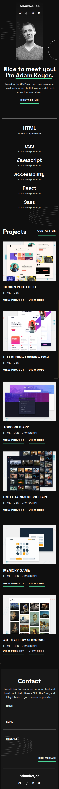
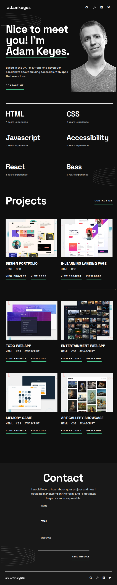
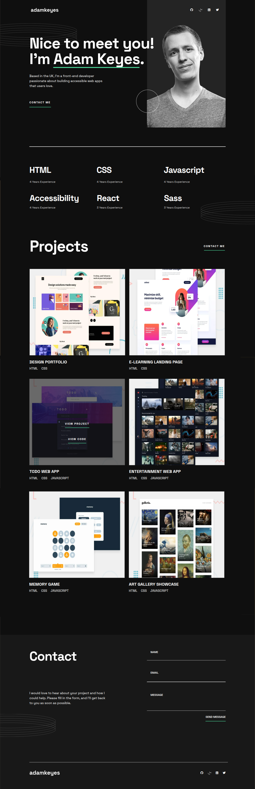

# Portfolio
## CSS Tarea Entregable 4 | Master Desarrollador Fullstack  de Conquer Blocks
Este proyecto pertenece a las proyectos evaluables del Master de desarrollador Fullstack de Conquer Blocks.
Se trata de un proyecto responsive con tres vistas, Mobile First, Tablet y Desktop:
- 1ª Vista Mobile (Smartphone), resolución 375px (como ejemplo Iphone XR o similar).
- 2ª Vista para Tablet, resolución 768px (como ejemplo Ipad Air o similar).
- 3ª Vista para Desktop, resolución a 1440px (no se adapta bien a grandes o muy grandes monitores, como los de 37").
### Puedes verlo en pages, en el siguiente enlace:
  [Portfolio](https://dclair.github.io/Portfolio/)\
 
 
 
